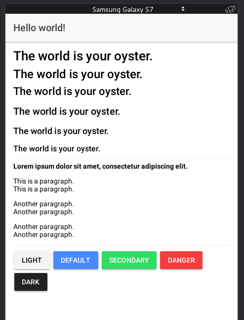

<h1>Probar la aplicación</h1>

<p>Esta app de ionic fue probada en GNU/Linux Debian 9 Stretch de 64bits.</p>

<br />

<b>Nota:</b>
* Usaremos $ para describir los comandos que se usaran con usuario regular.
* Usaremos # para describir los comandos que se usaran con superusuario.

<br />

<p>Es necesario tener NodeJS instalado en tu ordenador, lo instalamos con los siguientes comandos:</p>

```
# apt-get install curl

# curl -sL https://deb.nodesource.com/setup_10.x | bash -

# apt-get install -y nodejs
```

<p>Verificar la versión instalada:</p>

```
$ node -v
```

<p>Instalamos Ionic, se instala igual que Cordova. Aunque trabaje bajo ellos, Ionic tiene su propio instalador:</p>

```
# npm install -g cordova ionic
```

<p>Verificar la versión de ionic instalada:</p>

```
$ ionic -v
```

<p>Ahora accedemos al directorio helloWorld-ionic y escribimos el siguiente comando:</p>

```
$ ionic serve
```

<p>Nos pregunta si queremos instalar lo necesario para correr esa app, le decimos que sí.</p>

```
? Install @ionic/app-scripts? Yes
```

<p>Luego de que se instale lo necesario deberíamos poder ver nuestra app en el navegador, desde
la misma consola de comandos se nos indicara cual es la IP y el puerto para verla desde el navegador web.</p>

<h2>Captura de pantalla</h2>



<hr />

<a href="https://github.com/argenisosorio/GuiasLenguajes/blob/master/Ionic.txt">Más documentación sobre Ionic Framework aquí</a>